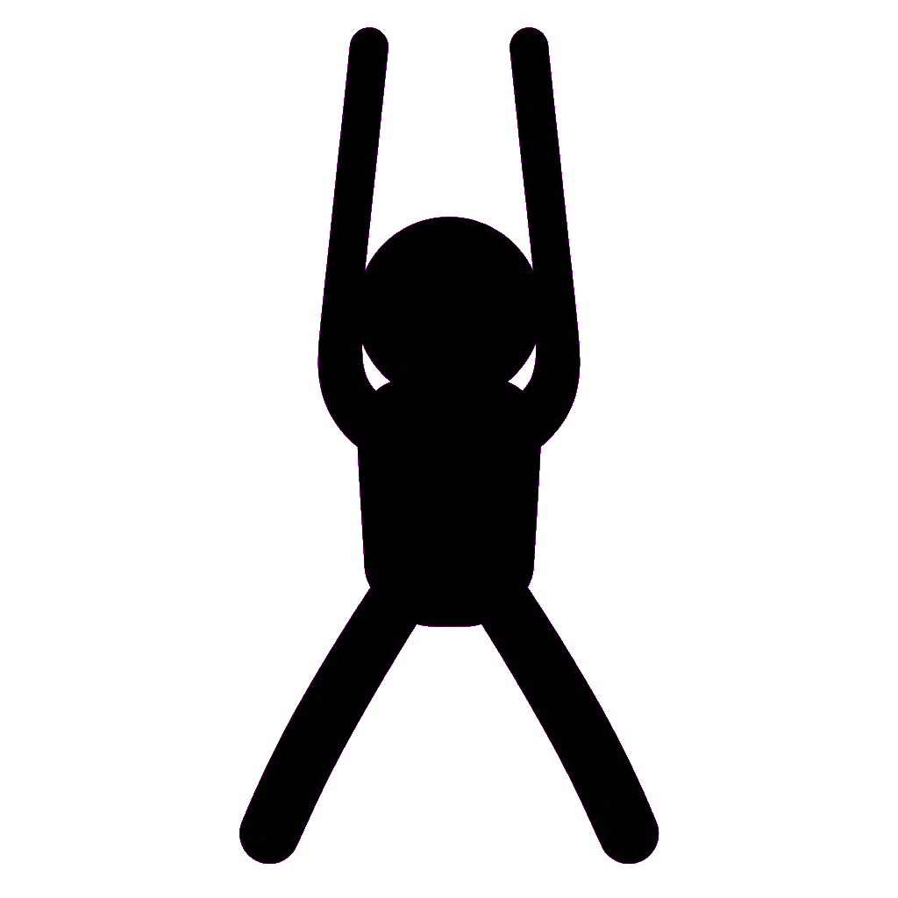

# Stick Arena

A top-down **stickman arena deathmatch** — Unreal-Tournament-style free-for-all you can drop into against AI bots (and other players). Run over weapons lying on the floor, frag everyone, climb the leaderboard. Inspired by XGen Studios' *Stick Arena*.

Built as a single long-horizon task: a server-authoritative multiplayer game on a plain **Node + `ws` + HTML5 canvas** stack — no build step, no framework. The arena is a whole **city block** — four furnished buildings (office, lounge, warehouse, diner) around a road cross with sidewalks and grass. Environment and furniture art is generated individually with an image model and chroma-keyed into transparent sprites; the characters themselves are drawn procedurally on the canvas (a rigged stick-figure whose arms pose per weapon and animate when attacking).



## Run it

```bash
npm install
npm start            # serves on http://localhost:3000
# or pick a port:
PORT=4000 npm start  # (also accepts: node server/index.js 4000)
```

Open the URL, type a name, hit **Play**. The arena is pre-populated with AI bots so it's lively solo; open more browser tabs to add humans.

## Controls

| Action | Keys |
| --- | --- |
| Move | **WASD** / arrow keys |
| Aim | **Mouse** |
| Shoot | **Left click** or **Space** (hold for automatic weapons) |
| Pick up a weapon | Walk over it on the floor |

Run out of ammo and you drop back to **fists**. Get fragged and you respawn after a couple of seconds with spawn protection.

## Weapons

Picked up from fixed spawn pads around the map; killed players also **drop** their weapon for a few seconds.

| Weapon | Type | Notes |
| --- | --- | --- |
| Fists | melee | default, unlimited |
| Bat | melee | big knockback |
| Katana | melee | high damage, wide reach |
| Pistol | hitscan | reliable all-rounder |
| Shotgun | hitscan | 8 pellets, brutal up close |
| Uzi | hitscan | very fast, sprays |
| Rifle | hitscan | accurate, long range |
| Sniper | hitscan | near one-shot, slow |

## How it works

**Server-authoritative.** The Node server owns the whole simulation and runs a fixed **30 Hz** tick. Clients only send input (`{up,down,left,right,aim,firing}`); the server simulates and broadcasts compact JSON snapshots. This is the same model an `.io` game uses, extended for combat.

- **Map** (`server/map.js`) — a procedurally-built **city block** on a typed-cell grid (60×44 tiles). Cell types cover grass / road / sidewalk and carpet / wood / tile interiors, plus exterior brick and interior walls; four buildings sit around a central road cross, each procedurally subdivided by a **seeded BSP** into multiple connected rooms (so all four are distinct/asymmetric) with 2–3 carved entrances and dense, themed furniture placed connectivity-safe; a flood-fill **repair pass** guarantees every room and spawn stays reachable. Provides circle-vs-tile **wall collision** (push-out), a DDA **raycast** for bullet wall-stops and bot **line-of-sight**, and UT-style spawn selection (farthest from living players).
- **Characters** (`public/js/render.js`) — drawn procedurally, not from a sprite: a circular head with two rigged arms that pose per weapon (one-handed pistol, two-handed rifle/shotgun/sniper, side grip for melee) and animate a swing arc or recoil kick, driven by an attack timer the server broadcasts.
- **Combat** (`server/game.js`) — guns are **hitscan**: a ray is cast per pellet, the nearest player along it (ray–circle intersection) within wall range takes damage; melee swings an arc. Hits, tracers, muzzle flashes, melee swipes and blood are emitted as ephemeral **effects** in each snapshot.
- **Weapons & pickups** (`server/constants.js`, `entities.js`) — fully data-driven weapon table; pickups refill their spawn pad on a timer.
- **Bots** (`server/bots.js`) — seek a weapon when unarmed, acquire the nearest enemy **with line-of-sight**, aim/strafe/close/back-off by weapon, flee at low health, and steer around walls.
- **Client** (`public/js/`) — `net.js` buffers snapshots and renders with ~100 ms **interpolation**; `render.js` draws the world (camera follow + clamp), sprites (with vector fallbacks), and the full HUD (health, weapon/ammo, rank, frag leaderboard, kill feed, minimap, crosshair).

### Network protocol (quick reference)

- **C→S:** `spawn{name}`, `input{u,d,l,r,a,f}`
- **S→C:** `config{...}` (map grid, props, weapons, asset manifest) once on connect; `spawned{id}`; then `u{self, ents, fx, lb, feed}` every tick.

## Assets

Every sprite and texture in `public/assets/` was generated **individually** with the OpenAI image MCP (`gpt-image-2`) on a flat magenta key color, then chroma-keyed to transparent PNGs (`remove_background`) — floor/wall/ground textures are kept opaque and tileable. There is **no whole-level image**; the city is composed from individual tiles and props at runtime.

- **Tiles:** `floor` (carpet) `wood` `tilefloor` `road` `sidewalk` `grass` `wall` `building`
- **Weapons:** `pistol` `shotgun` `uzi` `rifle` `sniper` `bat` `katana` (detailed pickups on the ground)
- **Furniture:** `desk` `chair` `table` `couch` `tv` `bookshelf` `shelf` `counter` `cooler` `crate` `plant`
- **Street:** `car` `tree` `streetlight` `bench` `hydrant`
- **UI:** `crosshair`

The renderer falls back to vector placeholders for any missing asset, so the game is fully playable without the art.

## Project layout

```
server/
  index.js       HTTP static server + WebSocket lifecycle + broadcast loop
  game.js        authoritative world: tick, combat, pickups, frags, snapshots
  map.js         tile arena, wall collision, raycast / line-of-sight, spawns
  entities.js    Player, Pickup
  bots.js        LOS-aware AI
  constants.js   tuning + the weapon table
  util.js        small math/id helpers
public/
  index.html, style.css
  js/ main.js · net.js · input.js · render.js
  assets/        generated sprites + tiles
```

## Possible next steps

- Binary snapshots + viewport culling (currently JSON, whole-arena broadcast — fine at this scale).
- Team modes / round timer / frag limit; weapon spread patterns; grenades & rockets (projectile entities).
- Client-side prediction for the local player (currently fully interpolated; great on LAN, adds input latency over WAN).
